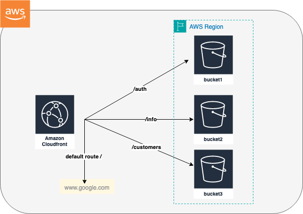

# ta-terraform
This project aims to create a cloudfront distribution to serve multiple S3 buckets based on path patterns.
The following schema explain the architecture



# Usage
To use this project and deploy the described infrastructure , these are the following steps : 

1. Update the terraform.tf file to set the backend tfstate configuration

2. Set the AWS region in variables.tf

3. Execute the following commands : 

```
terraform init
```
```
terraform workspace new <Environment>  # Environment can be dev, staging
```
```
terraform plan --var-file=tfvars/<Environment>.tfvars 
```
```
terraform apply new terraform plan --var-file=tfvars/<Environment>.tfvars 
```

# Terraform-docs
## Requirements

| Name | Version |
|------|---------|
| <a name="requirement_terraform"></a> [terraform](#requirement\_terraform) | ~> 1 |
| <a name="requirement_aws"></a> [aws](#requirement\_aws) | ~> 5 |

## Providers

No providers.

## Modules

| Name | Source | Version |
|------|--------|---------|
| <a name="module_cloudfront_s3"></a> [cloudfront\_s3](#module\_cloudfront\_s3) | ./modules/cf_s3 | n/a |

## Resources

No resources.

## Inputs

| Name | Description | Type | Default | Required |
|------|-------------|------|---------|:--------:|
| <a name="input_aws_region"></a> [aws\_region](#input\_aws\_region) | The name of the region where the s3 bucket will be hosted | `string` | n/a | yes |
| <a name="input_s3_hosting_config"></a> [s3\_hosting\_config](#input\_s3\_hosting\_config) | This specifies the s3 bucket informations and CF related path and origin | `list(any)` | n/a | yes |

## Outputs

| Name | Description |
|------|-------------|
| <a name="output_bucket_domain_names"></a> [bucket\_domain\_names](#output\_bucket\_domain\_names) | Bucket domains |
| <a name="output_bucket_ids"></a> [bucket\_ids](#output\_bucket\_ids) | Bucket Names |
| <a name="output_cf_domain_name"></a> [cf\_domain\_name](#output\_cf\_domain\_name) | The cloudfront distribution domain name |
| <a name="output_cf_id"></a> [cf\_id](#output\_cf\_id) | The cloudfront distribution ID |